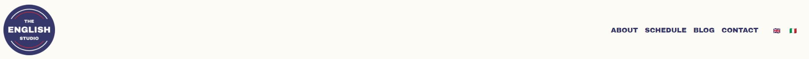
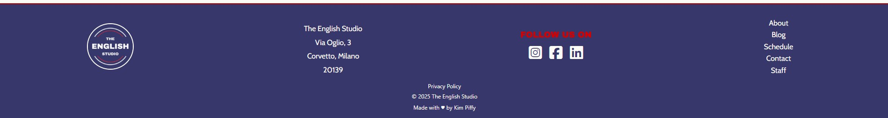
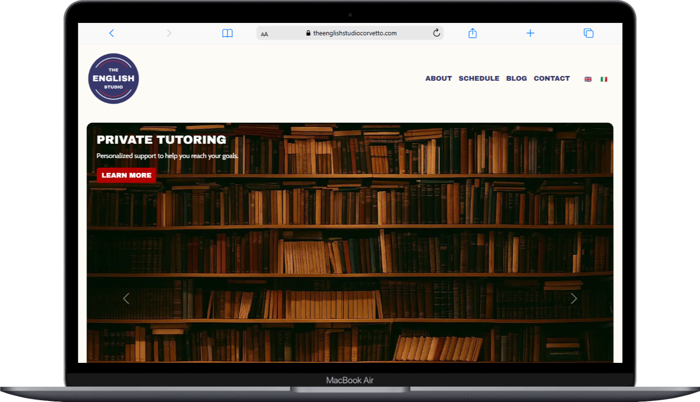
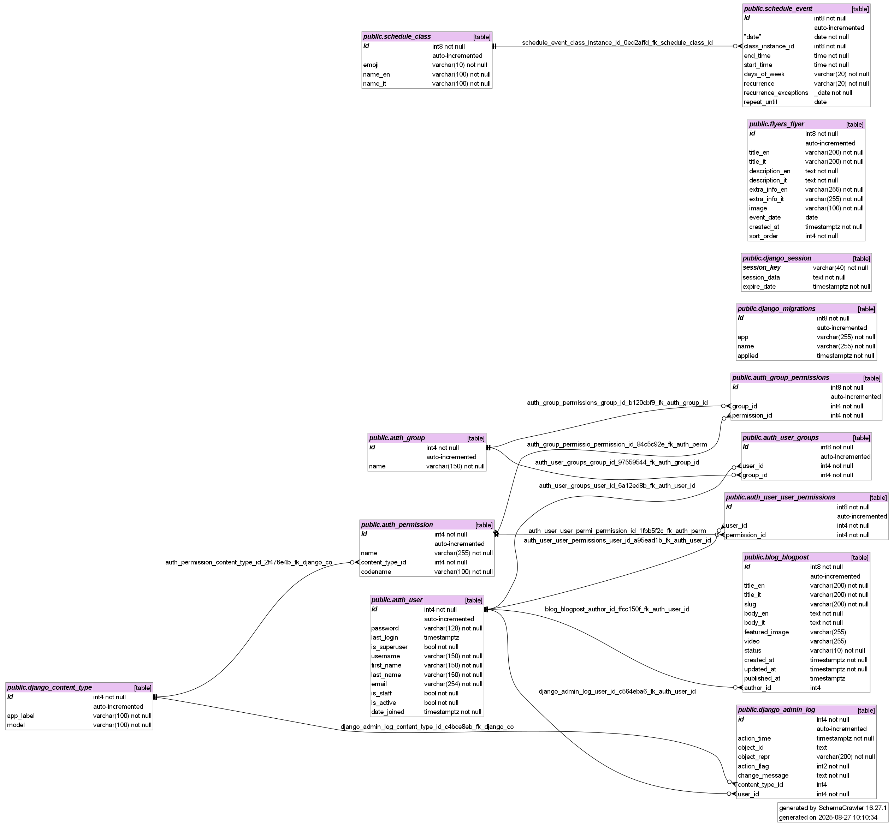

<h1 align="center"> Welcome to The English Studio </h1>
<p align="center">
  
</p>

The English Studio is a fully functioning, full-stack web application built for a real client launching a new English language school in Corvetto, Milan. Designed to support both public users and administrative staff, the site offers a clean, modern user experience with powerful backend functionality tailored to real educational needs.

**Key features include:**
- A fully integrated blog system that allows staff to create, edit, and delete posts through a custom frontend portal.
- A dynamic class and events scheduling system with full CRUD (Create, Read, Update, Delete) operations, enabling administrators to manage weekly lessons, special events, and recurring activities via an intuitive interface.
- A flyer upload system that allows staff to create, read, update, delete and reorder the flyers.
- An administrator profile for the owner which allows them to create further staff profiles via their portal login.
- A secure staff portal at `/portal`, providing private access to internal tools without exposing Django’s admin interface.
- Seamless frontend-backend integration, with JavaScript `fetch` powering smooth, interactive updates to blog posts and schedule entries.
- All data is stored in a PostgreSQL database hosted on Render, with a clean, normalised schema designed to reflect complex user stories and relationships between classes, events, and recurring schedules.
- The application demonstrates professional-grade quality, both in functionality and design, and is production-ready.

---

### Table of Contents

<details><summary><strong>UX – Goals</strong></summary>

- Business Goals
  - Primary Goal
  - Further Business Goals
- User Profiles
- User Stories
</details>

<details><summary><strong>UX – Visual Design</strong></summary>

- Fonts & Colours
- Wireframes 
</details>

<details><summary><strong>Features – All Pages (base.html)</strong></summary>

- Navbar
- Footer
</details>

<details><summary><strong>Features – Technical</strong></summary>

- Language Switching
- Custom form handling
- Environment variables
- Media handling
- Security
- Deployment
- Custom Recurrence Logic
</details>

<details><summary><strong>Features – Public</strong></summary>

- Homepage (index.html)
- Blog (blog_list.html / blog_detail.html)
- Interactive Schedule Calendar (calendar.html)
- Contact Form with Mailchimp Integration (contact.html)
</details>

<details><summary><strong>Features – Staff Portal (/portal)</strong></summary>

- Login Page (portal/login)
- Dashboard (portal)
- Blog Post Management
- Schedule Management
- Upcoming Events Flyers Management
- User Management
</details>

<details><summary><strong>Information Architecture</strong></summary>

- Database Structure
- Database Models
  - Class
  - Event
  - BlogPost
  - Flyer
</details>

<details><summary><strong>Environment Variables</strong></summary></details>

<details><summary><strong>Portal URL Map</strong></summary></details>

<details><summary><strong>i18n</strong></summary></details>

<details><summary><strong>Security & Privacy</strong></summary></details>

<details><summary><strong>Technologies Used</strong></summary>

- Languages
- Frameworks
- Django / Python Packages
- Third-Party Services
- Database
- Deployment & Dev Tools
</details>

<details><summary><strong>Testing</strong></summary>

- About Testing
- Validation
- Mobile & Desktop Testing
- Manual Testing
- User Story Testing
- Bugs
</details>

<details><summary><strong>Deployment</strong></summary>

- Local Development
- Production (Render)
</details>

<details><summary><strong>License</strong></summary></details>

<details><summary><strong>Credit & Contact</strong></summary></details>

---

<h2>UX – GOALS</h2>

<h3>1. Business Goals</h3>

<h4>Primary Goal</h4>

The primary objective of The English Studio website is to establish a strong and credible online presence from the school’s foundation, giving prospective students clear information that is easy to find and digest, which builds immediate trust — reflecting that the school can teach English in an easy, non-intimidating way.

The site should provide prospective students and administrative staff with clear, engaging information and fully functional backend tools to manage classes, events, and blog content efficiently.

By combining professional design with custom backend development, the platform empowers staff to run the school independently while offering potential students an accessible, user-friendly introduction to the school's values, activities, and educational offerings.

<h4>Further Business Goals</h4>

- Enable Internal Autonomy by providing staff with an easy-to-use portal to manage blog content, flyers, and scheduled events without relying on developers.
- Support School Growth by ensuring the site can scale with new features (e.g., optional future student logins).
- Deliver a Professional First Impression through a polished, modern design and clear messaging.
- Promote Local and International Visibility with an optimised structure, engaging content, and a clear public calendar.
- Ensure Data Security and Stability by storing and managing data with PostgreSQL and Django, and restricting staff access via a private portal.
- Streamline Communication through a categorised contact form and optional newsletter sign-up (Mailchimp).
- Uphold Accessibility and Responsiveness so the site is usable across devices and considerate of diverse user needs.

<h3>2. User Profiles</h3>

**Parents of Young Learners (Primary Audience)**  
Adults seeking fun, safe, and educational after-school activities for children aged 6–10.  
- **Needs:** A clear, visual schedule with fun event listings and details.  
- **Goals:** Help children engage joyfully with English while managing family schedules.

**Adult English Learners**  
Students preparing for **IELTS**, improving **Business English**, or seeking **private lessons**.  
- **Needs:** Course/event information, flexible options, accessible contact.  
- **Goals:** Quickly find a path that fits professional or immigration requirements.

**School Owner / Director**  
- **Needs:** A unified portal to manage posts, flyers, classes, and events (without public Django admin).  
- **Goals:** Keep content fresh and ensure the public calendar is accurate.

**English School Teacher / Club Organisers**  
- **Needs:** A secure portal to add/edit class schedules and event details.  
- **Goals:** Keep the public calendar current with minimal friction.

**Sponsors & Professional Partners**  
- **Needs:** Clear mission, professionalism, and evidence of community engagement.  
- **Goals:** Assess credibility and fit before offering support.

**Prospective Student / Newsletter Subscriber**  
- **Needs:** Simple newsletter opt-in and reassurance on data handling.  
- **Goals:** Receive timely updates on new classes, events, and announcements.

<h3>3. User Stories</h3>

- As *a teacher*, I want to create and update a monthly schedule with weekly lessons and one-off events, so the calendar always reflects the latest plan.  
- As *a parent*, I want to browse upcoming events with my child (e.g., Halloween party, Art Workshop), so we can choose activities and prepare.  
- As *the owner*, I want to manage blog posts, flyers, and event entries from an internal portal, so I don’t need developer help or the public Django admin.  
- As *a student planning to study in the UK*, I want to find IELTS prep and contact the school for private lesson availability tailored to my needs.  
- As *a working professional*, I want to quickly see Business English options (group or private) so I can prepare for meetings or team training.  
- As *a prospective sponsor/partner*, I want to see a professional, well-organised site with examples of work, so I feel confident collaborating.  
- As *a visitor*, I want to select a category in the contact form so my message reaches the right staff member.  
- As *a prospective student or parent*, I want to sign up for the newsletter so I can receive updates on classes and events without checking the site manually.

---

<h2> UX – VISUAL DESIGN </h2>

<p>
  
</p>

- All branding including logo design, font selection and colours were designed by the developer. These elements naturally reflect the Union Jack palette and symbolise “English.”

<p>
   
   
   
  
</p>

Carousel images were rendered by the developer to fit the professional academic feel of the site using OpenAI prompts matching the four class styles: private lessons, after school club, test prep, and business English.

Icons used in the “WHAT WE OFFER” section reference the brand to create descriptive symbols that complement the logo and reinforce brand identity.

<p>
   
   
   
   
   
  
</p>

<h3>FONTS & COLOURS</h3>

- The `primaryfont` is **Archivo Black** (from the logo).  
- The body font is **Cabin**, a smart, minimal sans-serif.

Navy (text): `#37376B`
Red (accents): `#B30000`
Off-white (bg): `#fdfbf6`


The navy/red are slightly muted to feel professional; the off-white background softens the overall feel (book-page vibe).

WIREFRAMES: 


---

<h2> FEATURES – ALL PAGES (loaded by base.html) </h2>

All pages feature a responsive navbar and footer.

<h3>1. Navbar</h3>

<div style="display: flex; align-items: flex-start; gap: 24px; flex-wrap: wrap;">
  
  
</div>

- Look & feel: super minimal, lots of breathing room. Off-white background, navy text, red accent. Brand-first.  
- Desktop: round logo on the left; right-aligned uppercase links — **ABOUT · SCHEDULE · BLOG · CONTACT**; GB/IT flags far right.  
- Mobile: right-side overlay menu; links stack vertically; hamburger morphs to a red **X** close button; flags inside the menu.  
- Hierarchy: logo → primary links → language.

<h3>2. Footer</h3>

<div style="display: flex; align-items: flex-start; gap: 24px; flex-wrap: wrap;">
  
  
</div>

- Solid navy panel with a thin red top border. White text; red “FOLLOW US ON” accent.  
- Desktop: three columns — (1) logo; (2) address + socials + legal; (3) quick links.  
- Mobile: everything centers and stacks; quick links become a single row; legal/meta at the bottom.

---

<h2> FEATURES – TECHNICAL </h2>

1. **Language Switching:** i18n enabled; English/Italian with locale prefixes.  
2. **Custom form handling:** Blog and schedule use Django forms + `fetch` for smooth UX.  
3. **Environment variables:** Sensitive settings via `.env` only.  
4. **Media handling:** Cloudinary for images/video.  
5. **Security:** Portal routes protected from public access.  
6. **Deployment:** Render (web service + Postgres).  
7. **Custom Recurrence Logic:** Datetime/calendar logic for recurring events with exceptions.

---

<h2> FEATURES – PUBLIC </h2>

<h3>1. Homepage (index.html)</h3>

<p>
  
  
  
  
</p>

- Professionally designed landing page with hero carousel; overlay headings and CTA link to “WHAT WE OFFER.”  
- “Learn English with Leanne” introduces the teacher to build trust; signature adds a personal touch.  
- Class selection with custom icons complements the information and reinforces branding.  
- All homepage content is bilingual (EN/IT) via the flags in the navbar.

<h3>2. Blog (blog_list.html / blog_detail.html)</h3>

<p>
  
  
</p>

- Blog list shows feature image, title, and date per post (card layout).  
- Detail page enlarges the image and presents content; video supported.  
- Prev/Next navigation and a button back to the list.  
- SEO-friendly slugs.  
- Fully bilingual content.

<h3>3. Interactive Schedule Calendar (calendar.html)</h3>

<p>
  
  
</p>

- Custom calendar view via **SCHEDULE**.  
- Emoji icons represent different classes/events; tooltips show details (multiple events listed together).  
- Month switching for past/future planning.

<h3>4. Contact Form with Mailchimp Integration (contact.html)</h3>

<p>
  
</p>

- Accessible form: name, email, phone, subject, message.  
- Emails sent with `reply_to` headers to the school address.  
- Optional newsletter opt-in (Mailchimp).  
- Google Maps API with custom branded pin.

---

<h2> FEATURES – STAFF PORTAL (/portal)</h2>

<h3>1. Login Page (portal/login)</h3>

<p>
  
</p>

- Secure login via Django auth; custom UI; redirects to dashboard on success.

<h3>2. Dashboard (portal)</h3>

<p>
  
</p>

- Central hub for blog and schedule management with quick links.

<h3>3. Blog Post Management</h3>

<p>
  
  
  
</p>

Staff can:
- Create bilingual posts (EN/IT).  
- Upload images/video to Cloudinary.  
- Edit, delete, backdate, toggle status (draft/published).  
- JS `fetch` for smooth saves.

<h3>4. Schedule Management</h3>

<p>
  
  
</p>

- Full CRUD for **Classes** (name + emoji; bilingual) and **Events** (time slots linked to classes).  
- Recurrence options: one-time, weekly, biweekly, monthly, custom days; with **exception dates**.  
- Validation to prevent bad date/time ranges.

<h3>5. Upcoming Events Flyers Management</h3>

<p>
  
  
  
</p>

Staff can:
- Create flyers with bilingual fields (EN/IT).  
- Upload flyer images (and optional PDFs, if enabled).  
- Reorder flyers via `sort_order` for homepage sequence.  
- Edit or delete flyers.

<h3>6. User Management</h3>

- Create/delete users, reset passwords, assign roles/permissions (staff/superuser).  
- Owner-created users can reset their own password via the portal login.  
- No public Django admin exposure.

---

<h2> INFORMATION ARCHITECTURE </h2>

<h3>1. Database Structure</h3>

The following ERD visualises relationships between the models.



**Key relationships**
- Each **Event** belongs to a **Class** (`ForeignKey`).  
- Events support **recurrence** with **exception dates** and optional **repeat-until**.  
- **BlogPost** is multilingual and authored by a Django **User**.  
- **Flyer** stores bilingual text and uses `sort_order` for manual homepage ordering.

Primary custom models: **Class**, **Event**, **BlogPost**, **Flyer**.

<h3>2. Database Models</h3>

### Class

| Field        | Type        | Notes |
|--------------|-------------|-------|
| `name_en`    | `CharField` | English name (required) |
| `name_it`    | `CharField` | Italian name (optional) |
| `emoji`      | `CharField` | Single emoji used in calendar/tooltips |
| `__str__()`  | method      | Readable label (emoji + name) |

### Event

| Field                   | Type                           | Notes |
|-------------------------|--------------------------------|-------|
| `class_instance`        | `ForeignKey(Class)`            | `on_delete=CASCADE` |
| `date`                  | `DateField`                    | Anchor date for one-offs/first occurrence |
| `start_time`            | `TimeField`                    | Local start |
| `end_time`              | `TimeField`                    | Local end |
| `recurrence`            | `CharField(choices)`           | `none`, `weekly`, `biweekly`, `monthly`, `custom_days` |
| `days_of_week`          | `CharField`                    | Comma list when `recurrence="custom_days"` (e.g., `Mon,Wed,Fri`) |
| `repeat_until`          | `DateField(null=True)`         | Optional final date |
| `recurrence_exceptions` | `ArrayField(Date)` / `JSONField` | Dates to skip (Postgres) |
| `__str__()`             | method                         | Readable summary |

**Indexes / performance (recommended)**
- Composite `(date, class_instance)` for calendar queries.  
- Partial index for future events: `WHERE date >= CURRENT_DATE`.

### BlogPost

| Field              | Type                        | Notes |
|--------------------|-----------------------------|-------|
| `title_en`         | `CharField`                 | English title |
| `title_it`         | `CharField`                 | Italian title (optional) |
| `slug`             | `SlugField(unique)`         | Used in URLs |
| `body_en`          | rich text (`TextField`/editor) | English content |
| `body_it`          | rich text                   | Optional Italian content |
| `featured_image`   | `ImageField`                | Cloud-hosted header image |
| `video`            | optional media field        | Optional |
| `author`           | `ForeignKey(User)`          | Post author |
| `status`           | `CharField`                 | Draft / Published |
| `created_at`       | `DateTimeField`             | Auto timestamp |
| `updated_at`       | `DateTimeField`             | Auto timestamp |
| `published_at`     | `DateTimeField`             | Controls visibility/order |
| `get_absolute_url()` | method                    | Returns `/blog/<slug>/` |

> The list template uses `featured_image`, `title_en/it`, `published_at`, and `slug`.

### Flyer

```python
class Flyer(models.Model):
    title_en = models.CharField(max_length=200)
    title_it = models.CharField(max_length=200, blank=True, default="")
    description_en = models.TextField(blank=True, default="")
    description_it = models.TextField(blank=True, default="")
    extra_info_en = models.CharField(max_length=255, blank=True, default="")
    extra_info_it = models.CharField(max_length=255, blank=True, default="")
    image = models.ImageField(upload_to="flyers/", blank=True, default="")
    event_date = models.DateField(blank=True, null=True)
    sort_order = models.PositiveIntegerField(default=0, db_index=True)
    created_at = models.DateTimeField(default=timezone.now, editable=False)

    class Meta:
        ordering = ["sort_order", "event_date", "id"]
```
| Field            | Type                   | Notes                                          |
| ---------------- | ---------------------- | ---------------------------------------------- |
| `title_en`       | `CharField(200)`       | Required                                       |
| `title_it`       | `CharField(200)`       | Optional                                       |
| `description_en` | `TextField`            | Optional                                       |
| `description_it` | `TextField`            | Optional                                       |
| `extra_info_en`  | `CharField(255)`       | Optional (short blurb)                         |
| `extra_info_it`  | `CharField(255)`       | Optional (short blurb)                         |
| `image`          | `ImageField`           | Stored under `flyers/` (cloud storage backend) |
| `event_date`     | `DateField(null=True)` | Optional                                       |
| `sort_order`     | `PositiveIntegerField` | **Indexed**; drag/drop order                   |
| `created_at`     | `DateTimeField`        | Audit                                          |
| `__str__()`      | method                 | Title fallback                                 |
| `Meta.ordering`  | —                      | `["sort_order","event_date","id"]`             |

Internationalisation (i18n) pattern

* Parallel EN/IT fields in models (e.g., title_en / title_it).
* Templates resolve via LANGUAGE_CODE.
* Simple queries; no translation tables.

| Key                      | Required | Example                                                       | Purpose                            |
| ------------------------ | -------- | ------------------------------------------------------------- | ---------------------------------- |
| `SECRET_KEY`             | ✅        | `django-insecure-…`                                           | Django crypto/signing key.         |
| `DEBUG`                  | ✅        | `False`                                                       | Never `True` in production.        |
| `ALLOWED_HOSTS`          | ✅        | `theenglishstudiocorvetto.com,.onrender.com`                  | Comma-separated hostnames.         |
| `CSRF_TRUSTED_ORIGINS`   | ✅        | `https://theenglishstudiocorvetto.com,https://*.onrender.com` | CSRF origin safelist.              |
| `DATABASE_URL`           | ✅        | `postgres://…`                                                | Render Postgres connection string. |
| `CLOUDINARY_URL`         | ✅        | `cloudinary://…`                                              | Media storage backend.             |
| `GOOGLE_MAPS_API_KEY`    | ✅        | `AIza…`                                                       | Contact page map loader.           |
| `MAILCHIMP_API_KEY`      | ⬜        | `usX-…`                                                       | Newsletter opt-in.                 |
| `MAILCHIMP_LIST_ID`      | ⬜        | `abcd1234`                                                    | Audience ID.                       |
| `DJANGO_SETTINGS_MODULE` | ⬜        | `the_english_studio.settings`                                 | Usually default.                   |
| `SECURE_SSL_REDIRECT`    | ⬜        | `True`                                                        | Force HTTPS (prod).                |

| Area                | Method | Path (i18n prefix varies)                                               | Notes                  |
| ------------------- | ------ | ----------------------------------------------------------------------- | ---------------------- |
| Schedule Portal     | `GET`  | `/en/schedule/portal/`                                                  | Admin schedule UI.     |
| Delete Event        | `POST` | `/en/schedule/portal/_/events/<id>/delete/`                             | Confirmed 200 in logs. |
| Delete Class        | `POST` | `/en/schedule/portal/_/classes/<id>/delete/`                            | Confirmed 200 in logs. |
| Create/Update Event | `POST` | ``, `` | Used by `schedule.js`. |
| Create/Update Class | `POST` | ``, `` | Used by `schedule.js`. |

i18n

* Locale prefixes: /en/... and /it/... (Django LocaleMiddleware).
* Translate templates with  / .
* Update translations:
`django-admin makemessages -l it`
`django-admin compilemessages`

Security & Privacy

Secrets only via environment variables; never committed.

HTTPS enforced (e.g., SECURE_SSL_REDIRECT=True); HSTS handled by platform.

Personal data handled by contact form/newsletter; document retention and GDPR contact.

Backups: Render Postgres snapshots (plus any additional policy you adopt).

Error logging: Render logs (add Sentry if you choose).

<h2> TECHNOLOGIES USED </h2> 

<h3>1. Languages</h3> 

* Python
* HTML
* CSS
* JavaScript

<h3>2. Frameworks</h3> 

* Django (5.x)
* Bootstrap 5, 
* CKEditor (via `django-ckeditor`). 
 
 <h3>3. Django / Python Packages</h3> 

* cloudinary
* django-cloudinary-storage
* django-ckeditor
* dj-database-url
* gunicorn
* pillow
* psycopg2-binary
* python-decouple
* python-dotenv
* python-dateutil
* requests
* whitenoise
* sqlparse
* asgiref
* certifi
* idna
* charset-normalizer
* tzdata
* urllib3
<h3>4. Third-Party Services</h3>

* Render: App & Postgres hosting
* Cloudinary: Media storage
* Mailchimp: Newsletter opt-in (optional)
* Google Maps API: Contact page map
* GoDaddy: Domain registrar/DNS

<h3>5. Database</h3> 

* PostgreSQL. 

<h3>6. Deployment & Dev Tools</h3>

* Render
* GitHub
* GitHub Codespaces
* Environment variables (`.env`) for all secrets

<h2> TESTING </h2> <h3>1. About Testing</h3> 

Extensive manual testing across views, forms, interactions, devices; non-technical users involved for realistic feedback. Colour contrast checked against WCAG 2.1. CSS validated (W3C Jigsaw).
A full breakdown of tests is in TESTING.md. Debug history lives in BUGLOG.md.

<h3>2. Validation</h3>

See [TESTING.md](TESTING.md).

<h3>3. Mobile & Desktop Testing</h3>

See [TESTING.md](TESTING.md).

<h3>4. Manual Testing</h3>

See [TESTING.md](TESTING.md).

<h3>5. User Story Testing</h3>

See [TESTING.md](TESTING.md).

<h3>6. Bugs</h3>

See [BUGLOG.md](BUGLOG.md); unresolved items listed at the bottom of [TESTING.md](TESTING.md).

<h2> DEPLOYMENT </h2>

The website is deployed at https://theenglishstudiocorvetto.com

<h3>1. Local Development</h3>

Requirements: Python 3.9+, pip, Git, (optional) PostgreSQL, Cloudinary/Mailchimp accounts if using those features.

### 1) Clone
git clone https://github.com/kimjev-webdev/theenglishstudiocorvetto.git
cd theenglishstudiocorvetto

### 2) Virtualenv
python3 -m venv .venv
#### Windows:
.venv\Scripts\activate
#### macOS/Linux:
source .venv/bin/activate

### 3) Install deps
pip install -r requirements.txt

### 4) Create .env from env.example and fill values

### 5) Migrate & superuser
python manage.py migrate
python manage.py createsuperuser

### 6) Run
python manage.py runserver

Visit http://127.0.0.1:8000
 (Django admin at /admin).

<h3>2. Production (Render)</h3>

* Build: pip install -r requirements.txt && python manage.py migrate && python manage.py collectstatic --no-input

* Start: gunicorn the_english_studio.wsgi:application

* Configure environment variables in Render dashboard.

* Static files: served via WhiteNoise; (optional) configure a static route if needed.

<h2> LICENSE </h2>

Proprietary License – The English Studio Website

Copyright (c) 2025 The English Studio. All rights reserved.

This project (including all source code, designs, images, copy, and build
artifacts) is proprietary to The English Studio (“Client”). It may not be
copied, reproduced, modified, distributed, publicly displayed, or used for
any purpose other than operating and maintaining The English Studio website,
except with the Client’s prior written permission.

1) Ownership
   - All intellectual property in this repository belongs to The English Studio.
   - All branding, logos, images, and written content are owned by the Client.
   - Any third-party components remain the property of their respective owners
     and are licensed separately as noted in their documentation.

2) Limited Use Grant
   - The Client and its expressly authorized staff/contractors are granted a
     non-transferable, non-sublicensable license to use, run, and modify this
     codebase solely for the operation and maintenance of The English Studio
     website.
   - No other rights are granted.

3) Restrictions
   - No redistribution, relicensing, or sale of this code or assets.
   - No copying or reuse in other projects, products, or services.
   - No extraction of components (including styles, images, or copy) for
     unrelated use.
   - No publication of source code or assets in public repositories or package
     registries without the Client’s written consent.

4) Trademarks & Branding
   - The English Studio name, logo, and brand elements may not be used without
     the Client’s written permission.

5) Third-Party Software
   - This project may include third-party libraries or services (e.g., Django,
     Bootstrap, Cloudinary, Mailchimp, Google Maps). Such components are
     governed by their own licenses and terms, which must be followed.

6) Termination
   - Any breach of these terms immediately terminates the license.

7) “AS IS” Disclaimer
   - The software is provided “AS IS”, without warranties of any kind, express
     or implied, including but not limited to fitness for a particular purpose.

8) Future Open-Source Option
   - If the Client decides to open-source this project, this file may be
     replaced with an open-source license (e.g., MIT or BSD-3-Clause).

For permissions or questions, contact:
The English Studio — theenglishstudio.corvetto@gmail.com

<h2> CREDIT & CONTACT </h2>

All content and structure were developed for a real-world client project. Media, blog posts, and calendar data are owned by the client.

Developer
📧 kimjev.webdev@gmail.com

🔗 https://github.com/kimjev-webdev/theenglishstudiocorvetto